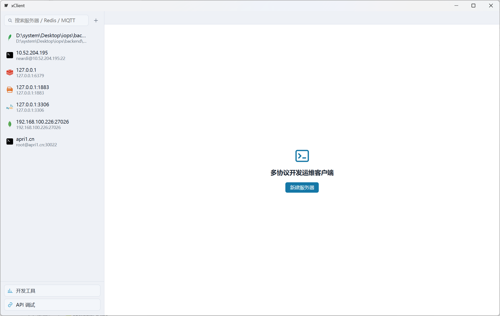
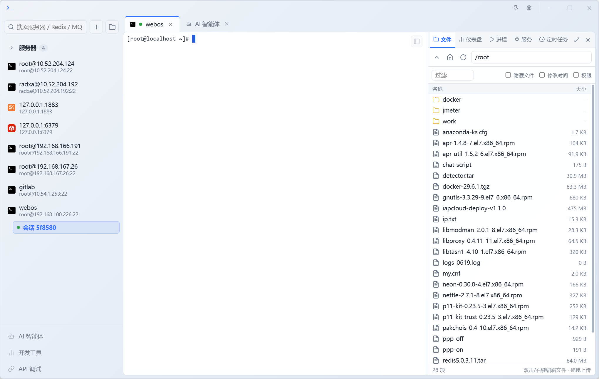

# xClient — 多协议开发运维桌面客户端

基于 [Wails v2](https://wails.io) + React + TypeScript + xterm.js 的跨平台桌面客户端。
集成了 SSH 终端、SFTP 文件管理、Redis、MySQL、MQTT 与 HTTP 接口调试等常用运维工具，
所有连接在同一窗口内以标签 / 侧栏形式管理，互不干扰。





## 功能清单

| 核心模块 | 功能特性 | 详细说明 |
| :--- | :--- | :--- |
| **SSH 终端** | 多会话标签页管理 | 支持多服务器/多会话 Tab 标签页切换，切换后会话输出不丢失 |
| | PTY Shell 交互 | 真实 PTY (`xterm-256color`)，支持窗口自适应 resize、256色、鼠标滚动与超链接 |
| | 安全认证与保活 | 支持密码与私钥认证（包含 Passphrase），内置 30 秒自动心跳保活 |
| | 系统运维扩展工具 | 集成服务器 CPU/内存/磁盘/网络 **仪表盘**、**Docker** 容器镜像管理、**进程**监控与 terminate、**Systemd** 服务管理、**Crontab** 定时任务编辑 |
| **SFTP 文件管理** | 高效目录浏览 | 目录面包屑导航、路径直达、名字过滤、隐藏文件开关 |
| | 拖拽上传与管理 | 支持从系统文件管理器将文件/文件夹拖拽至面板自动递归上传；支持右键下载、重命名、复制路径、递归删除 |
| | 批量传输队列 | Ctrl / Shift 多选批量下载与删除，实时进度条、传输速率占比、失败原因及取消管理 |
| **Redis 数据库** | Key 浏览与分层树 | 多 DB 切换 (DBSize 展示)，基于 SCAN 游标分页与 Pattern 搜索，支持平铺/分层 Key 树视图 |
| | 数据结构全支持 | 支持 `String` / `Hash` / `List` / `Set` / `ZSet` 查看与细粒度增删改，TTL (过期时间) 管理 |
| | 高级特性面板 | 支持 **Pipeline** 批量指令、**MULTI/EXEC/WATCH** 事务、**Pub/Sub** 实时频道/模式发布订阅、**List/Stream** 消息队列、**键事件**监听与**慢日志**、熔断与连接池**性能监控看板** |
| **MySQL 数据库** | 库表浏览与网格编辑 | 数据库与数据表树状浏览、DESCRIBE 表结构与索引状态查看；支持表格 Limit 分页、固定表头、斑马纹 |
| | 单元格在线编辑 | 单元格行内直写编辑（新增/修改/删除行，NULL 处理与原生同步） |
| | SQL 编辑与可视化 | 多标签 SQL 编辑器（含历史记录）、数据库对象管理（建库/删库、建表/删表、建索引/删索引）、用户权限管理 (GRANT) |
| | 监控、ER 图与导入导出 | 服务器状态/变量监控与进程列表；根据外键自动生成 **ER 关系图**；支持 SQL/CSV/JSON 导入导出与整库 SQL 备份 |
| **MongoDB 数据库** | 集合与文档管理 | 数据库/集合树状浏览，文档 JSON 网格/层级预览、增删改查与分页 |
| | 聚合、事件与监控 | **Aggregate** 聚合管道构建与执行；**ChangeStream** 实时变更事件流监听；集合索引管理与 Schema 验证器；服务器 Health 监控 |
| **SQLite 数据库** | 本地纯 Go 驱动 | 无需主机/端口，通过文件选择器直接打开 `.db` / `.sqlite` 文件 |
| | 库表浏览与数据预览 | 浏览视图/数据表、DESCRIBE 表结构与索引状态；统一风格数据表格预览 |
| | 跨平台无 CGO 依赖 | 基于 `modernc.org/sqlite` 驱动，无需安装 SQLite 动态库 |
| **MQTT 客户端** | Broker 连接与发布订阅 | 支持连接主流 MQTT Broker (包含认证选项)，消息 QoS 控制、Retain 保留标志控制 |
| | 消息实时流 | 支持订阅/取消订阅指定 Topic，收发消息流实时时间戳列表化展示 |
| **API 接口调试** | HTTP 客户端 | 支持 GET / POST / PUT / PATCH / DELETE / HEAD / OPTIONS 等 HTTP 方法 |
| | 请求与响应美化 | 协议头自动补全 (`http://`)、Header / Body (JSON/Text/XML) 编辑、Basic/Bearer 鉴权，JSON 响应美化与状态码高亮 |
| | WebSocket 调试 | 支持 WebSocket 客户端连接测试、发送文本/JSON 消息与双向实时消息日志 |
| | 历史记录持久化 | 自动保存最近 30 条请求历史，支持单条删除与本地持久化 |
| **常用开发工具集** | 快捷实用工具 | **MD5 哈希**（实时 32 位计算与一键复制）、**时间戳转换**（毫秒级刷新与日期双向转换）、**Base64 编解码**（文本编码解码） |
| **连接与安全配置** | 敏感加密持久化 | 服务器配置与凭据本地加密存储，密码/私钥/Passphrase 采用 **AES-GCM** 高强度加密 |
| | 配置存储路径 | Windows: `%APPDATA%/xClient`；Linux/macOS: `~/.config/xClient` |

## 代码结构与文件功能

### 后端结构 (Go Backend)

```
terminal/
├── main.go               // Wails 应用主入口，初始化窗口参数与系统级文件拖放
├── app.go                // App 核心生命周期、服务器/分组/设置配置管理与 HTTP/WS 调试
├── app_ssh.go            // 暴露给前端的 SSH 终端会话、系统运维 (Dashboard/进程/服务/Cron) 与 Docker 接口
├── app_sftp.go           // 暴露给前端的 SFTP 文件管理、传输队列控制与本地文件对话框
├── app_mysql.go          // 暴露给前端的 MySQL 核心及扩展管理接口
├── app_redis.go          // 暴露给前端的 Redis 键值、数据结构与高级特性接口
├── app_mongo.go          // 暴露给前端的 MongoDB 集合、文档、聚合与 ChangeStream 接口
├── app_sqlite.go         // 暴露给前端的 SQLite 本地文件数据库操作接口
├── app_mqtt.go           // 暴露给前端的 MQTT Broker 发布订阅与会话控制接口
├── core/                 // 核心基础设施与通用配置
│   ├── config.go         // 服务器连接配置管理、读写与敏感字段 AES-GCM 加密存储
│   └── sftp.go           // SFTP 目录/文件读写、上传下载任务队列与传输进度广播
├── ssh/                  // SSH 协议与 Linux 系统运维工具
│   ├── ssh.go            // SSH 连接建立、PTY 交互终端 Shell 与实时输出推流
│   ├── ssh_cron.go       // Crontab 定时任务查询、解析与编辑
│   ├── ssh_dashboard.go  // 服务器 CPU、内存、磁盘及网络系统资源实时监控
│   ├── ssh_docker.go     // Docker 容器与镜像管理接口
│   ├── ssh_process.go    // 进程列表查询 (ps) 与进程终止 (kill)
│   └── ssh_service.go    // Systemd 系统服务状态查看与控制 (start/stop/restart)
├── redis/                // Redis 数据库引擎
│   ├── redis.go          // Redis 客户端连接管理、基本 Key 扫描与键值增删改
│   ├── redis_data.go     // Redis Pipeline 批量操作、MULTI 事务、Pub/Sub 与 Queue 消息队列
│   └── redis_utils.go    // Redis 数据转换与格式化工具函数
├── mongo/                // MongoDB 数据库引擎
│   ├── mongo.go          // MongoDB 基础连接、数据库/集合浏览及文档 CRUD 操作
│   └── mongo_tx.go       // MongoDB 聚合管道 (Aggregate)、ChangeStream 监听、索引与 Schema 校验
├── db/                   // 关系型数据库引擎 (MySQL / SQLite)
│   ├── mysql.go          // MySQL 连接池管理、网格数据预览、表结构查询与单元格更新
│   ├── mysqlx.go         // MySQL 扩展工具（SQL/CSV/JSON 导入导出及整库 SQL 备份）
│   └── sqlite.go        // SQLite 纯 Go 驱动连接管理、表/结构/索引/数据查询
└── proto/                // 网络接口调试引擎
    ├── httpapi.go        // HTTP / RESTful API 请求发包引擎（支持 Header/Body/Auth/TLS）
    └── ws.go             // WebSocket 客户端连接管理与双向消息推流
```

### 前端结构 (React + TypeScript Frontend)

```
frontend/src/
├── main.tsx              // React 应用入口与 DOM 挂载
├── App.tsx               // 全局根组件，集成 Sidebar 侧栏、SessionTabs 标签页、Stage 主舞台与 Setting 弹窗
├── api.ts                // Wails 绑定 API 统一封装与后端 EventEmitter 事件订阅总线
├── types.ts              // 全局 TypeScript 类型定义（服务器配置、会话信息、API 数据模型）
├── utils.ts              // 全局辅助函数库（字节格式化、时间格式化、Base64 编解码、错误捕获）
├── styles/               // 全局 CSS/LESS 设计 Token 与样式系统
│   ├── global.module.less// 全局通用按钮、标签、微调组件样式库
│   ├── mixins.less       // LESS 通用布局 Mixins 与动画函数
│   └── variables.less    // 设计 Token（主题色、间距、字体、圆角、层级）
├── components/           // 跨页面复用的纯粹共享 UI 组件
│   ├── ClientIcon.tsx    // 协议图标渲染组件（SSH / Redis / MySQL / Mongo / SQLite / MQTT）
│   ├── CodeEditor.tsx    // 基于 CodeMirror 的代码与文本编辑器组件
│   ├── ContextMenu.tsx  // 全局右键上下文菜单
│   ├── DevTools.tsx      // 常用开发工具小组件（MD5、时间戳转换、Base64 编解码）
│   ├── Icon.tsx          // 矢量 SVG 图标组件库
│   ├── Modal.tsx         // 确认对话框 (ConfirmModal) 与输入对话框 (PromptModal)
│   ├── ServerDialog.tsx  // 新建/编辑服务器连接配置对话框组件
│   ├── Sidebar.tsx       // 侧边栏服务器列表、分组管理与连接控制
│   ├── TransferBar.tsx   // 底部 SFTP 文件传输任务进度栏
│   └── app/              // 顶层框架辅助组件
│       ├── SessionTabs.tsx// 已连接多协议会话顶栏标签页
│       └── Stage.tsx      // 主内容舞台组件，根据当前 Tab 路由激活客户端
└── pages/                // 按业务域和功能拆分的页面模块
    ├── api/              // HTTP / WebSocket API 接口调试页面
    │   ├── ApiClient.tsx       // HTTP API 调试主框架
    │   ├── ApiConfigTabs.tsx   // 请求参数 / Params / Headers / Body / Auth 配置面板
    │   ├── ApiHistory.tsx      // 请求历史记录侧边栏
    │   ├── HttpRequest.tsx     // 请求 URL 地址栏与响应结果展示面板
    │   ├── WsClient.tsx        // WebSocket 双向通信测试面板
    │   ├── apiShared.module.less// API 模块共享样式
    │   ├── apiTypes.ts         // API 模块专用类型
    │   └── useApi.ts           // API 状态管理 Hook
    ├── mongo/            // MongoDB 数据管理页面
    │   ├── MongoClient.tsx     // MongoDB 客户端主框架与侧栏数据库/集合树
    │   ├── AggregateTab.tsx    // 聚合管道 (Aggregate Pipeline) 构建与执行
    │   ├── ChangeStreamTab.tsx // 实时 Change Stream 事件流监听
    │   ├── DocumentsTab.tsx    // 集合文档 JSON 列表、分页查询与文档增删改
    │   ├── IndexesTab.tsx      // 集合索引列表与建索引操作
    │   ├── MonitorTab.tsx      // MongoDB 服务器状态与健康监控
    │   ├── SchemaTab.tsx       // 集合 Schema 字段分析与 Validator 验证器配置
    │   ├── mongoShared.module.less// Mongo 模块共享样式
    │   └── mongoTypes.ts       // Mongo 模块专用类型
    ├── mqtt/             // MQTT 客户端页面
    │   └── MqttClient.tsx      // MQTT 消息发布/订阅、QoS 控制与接收列表
    ├── mysql/            // MySQL 数据管理页面
    │   ├── MysqlClient.tsx     // MySQL 客户端主框架与侧栏数据库/数据表树
    │   ├── CellEditorInline.tsx// 数据表格行内单元格编辑器
    │   ├── DataTab.tsx         // 表格数据网格预览与行级增删改
    │   ├── ErDiagram.tsx       // 外键 ER 关系图生成与展示
    │   ├── IoModal.tsx         // SQL/CSV/JSON 数据导入导出与备份对话框
    │   ├── ObjModal.tsx        // 建库/建表/删表/建索引/删索引管理对话框
    │   ├── SqlEditor.tsx       // 自定义 SQL 执行与结果展示编辑器
    │   ├── StatusCard.tsx      // 状态指标卡片展示组件
    │   ├── StatusPanel.tsx     // MySQL 服务器状态与变量监控面板
    │   ├── UsersPanel.tsx      // MySQL 用户账户与 Grant 权限列表
    │   ├── dbTable.module.less // 关系型数据库统一表格展示样式
    │   ├── mysqlShared.module.less// MySQL 模块共享样式
    │   └── mysqlTypes.tsx      // MySQL 模块专用类型
    ├── redis/            // Redis 键值与高级特性调试页面
    │   ├── RedisClient.tsx     // Redis 调试客户端主框架
    │   ├── BatchPanel.tsx      // Pipeline 批量执行与事务 (MULTI/EXEC/WATCH) 面板
    │   ├── KeyItemTree.tsx     // 树状 Key 分层目录展示组件
    │   ├── KeysTab.tsx         // Key 搜索、树状/平铺切换、TTL、值编辑器与命令行 CLI
    │   ├── KeyspaceTab.tsx     // 键事件监听与慢查询日志列表
    │   ├── MonitorTab.tsx      // 熔断状态、命中率与连接池监控看板
    │   ├── PubSubTab.tsx       // 频道/模式发布订阅面板
    │   ├── QueueTab.tsx        // List 与 Stream 消息队列入队/出队面板
    │   ├── ValueEditor.tsx     // Hash / List / Set / ZSet 细粒度修改编辑器
    │   ├── redisShared.module.less// Redis 模块共享样式
    │   └── redisTypes.ts       // Redis 模块类型定义与格式化工具函数
    ├── setting/          // 全局应用设置页面
    │   ├── SettingsModal.tsx   // 设置弹窗主框架与导航侧栏
    │   ├── AppearanceTab.tsx   // 外观与主题设置（浅/暗模式、全局界面字体）
    │   └── AboutTab.tsx        // 关于应用展示（版本标识、环境信息、描述）
    ├── sqlite/           // SQLite 本地数据库管理页面
    │   └── SqliteClient.tsx    // SQLite 客户端（表/视图数据预览、结构与索引查看）
    └── ssh/              // SSH 终端与远程 Linux 运维工作区
        ├── SessionWorkspace.tsx// SSH 工作区主框架（Terminal + 右侧扩展面板）
        ├── cron/               // Crontab 定时任务管理与表达式生成 (CronPanel, CronModal)
        ├── dashboard/          // 服务器 CPU/内存/磁盘/网络状态仪表盘 (DashboardPanel)
        ├── docker/             // Docker 容器与镜像管理面板 (DockerPanel)
        ├── file/               // SFTP 文件管理器与远程文件编辑器 (FilePanel, FileEditorModal)
        ├── process/            // 系统进程监控与终止 (kill) 面板 (ProcessPanel)
        ├── service/            // Systemd 系统服务管理面板 (ServicePanel)
        └── terminal/           // xterm.js 网页终端交互面板 (TerminalView)
```

## 开发

```bash
wails dev
```

## 构建

```bash
wails build
```

> 说明：系统级文件拖放依赖 Wails 的 `DragAndDrop.EnableFileDrop`，需在打包后的桌面窗口中使用；
> 浏览器调试模式下会自动降级为读取文件内容上传。
