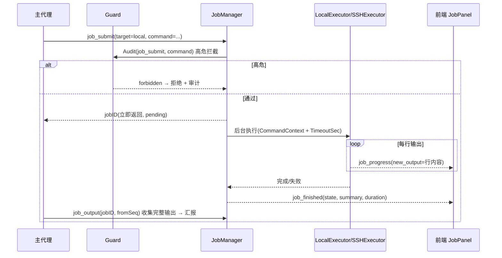

# xAgent 2.0 遗留项功能设计与实现文档（MEDIUM-1 / MEDIUM-2 / MEDIUM-3）

| 项目 | 内容 |
| :--- | :--- |
| 文档版本 | v0.1（设计草案） |
| 依据 | `docs/agent-upgrade-review.md` 附录第二轮复查遗留的 3 项 MEDIUM |
| 适用范围 | `agent/job/`、`agent/executor/`、`agent/verifier/`、`agent/tools/orchestration.go`、`agent/events/`、`agent/memory/`、`app_agent.go`、前端 `AiAgentPanel.tsx` |
| 设计原则 | 复用既有 guard / event / job / store 体系，不新造轮子；每个能力默认走既有审批与审计链路 |

遗留三项：

| 编号 | 遗留问题 | 位置 |
| :--- | :--- | :--- |
| **MEDIUM-1** | `job_submit` 为桩实现：run 函数仅 `time.Sleep` 模拟进度，未真正执行 `input.Command` | `agent/tools/orchestration.go:126-142` |
| **MEDIUM-2** | Executor 串行执行，`DependsOn` 未实现 DAG 并行；失败即返回无重试/换招；Verifier 仅关键字启发式 | `agent/executor/executor.go`、`agent/verifier/verifier.go` |
| **MEDIUM-3** | `ask_user` 工具为占位（返回字符串，未接 `agent:ask` 通道）；episodic 情节记忆自动摘要未实现 | `agent/tools/orchestration.go:443`、`agent/memory/memory.go` |

---

## 1. MEDIUM-1：作业真实执行引擎（Job Execution Engine）

### 1.1 现状与问题

`job_submit` 的 run 函数是模拟实现：

```go
jobID := mgrs.JobMgr.Submit(ctx, input.SessionID, input.Name, func(...) {
    emitProgress(0.1, "开始执行后台作业", ...)
    time.Sleep(500 * time.Millisecond)   // ← 桩
    emitProgress(0.6, "执行指令中", ...)
    time.Sleep(500 * time.Millisecond)   // ← 桩
    return "作业执行完成", nil
})
```

`JobSubmitInput` 已有 `Command` / `TimeoutSec` 字段但从未使用。作业系统（`JobManager`：状态机、进度、增量输出、Kill、持久化、完成即通知）本身已完备，缺的是**真实的执行器**。

### 1.2 设计目标

- `job_submit` 提交的作业**真正执行命令**：本地 Shell 命令 或 远程 SSH 命令；
- 命令执行过程实时流入 `job_output`（增量序列）并推送前端 JobPanel；
- 超时、取消（Kill）、进度上报、终态持久化全部复用现有 JobManager；
- **命令内容必须走高危拦截与确认**（复用 `guard.auditShellCommand`），不允许作业成为绕过权限的后门。

### 1.3 作业执行模型

扩展 `JobSubmitInput`：

```go
type JobSubmitInput struct {
    SessionID   string `json:"session_id,omitempty" jsonschema:"description=所属会话 ID，留空使用当前会话"`
    Name        string `json:"name" jsonschema:"description=作业名称"`
    Description string `json:"description" jsonschema:"description=异步长任务描述与指令"`
    Target      string `json:"target,omitempty" jsonschema:"description=执行目标: local(默认,本地Shell) | ssh(远程SSH)"`
    Session     string `json:"session,omitempty" jsonschema:"description=Target=ssh 时的 SSH 会话 ID 或名称"`
    Command     string `json:"command" jsonschema:"description=要执行的命令或脚本指令"`
    Cwd         string `json:"cwd,omitempty" jsonschema:"description=本地执行时的工作目录，默认使用当前绑定的工作区"`
    Shell       string `json:"shell,omitempty" jsonschema:"description=本地 Shell: 留空自动选择 (Windows: powershell, 其他: bash)"`
    TimeoutSec  int    `json:"timeout_sec,omitempty" jsonschema:"description=超时时间 (秒)，默认 300"`
    Env         map[string]string `json:"env,omitempty" jsonschema:"description=可选环境变量"`
}
```

### 1.4 执行器抽象（新文件 `agent/job/executor.go`）

```go
// JobExecutor 真实执行一个作业指令，产出增量输出。
type JobExecutor interface {
    // Execute 返回的 output 回调用于增量推送（stdout/stderr 合并按行切分）。
    Execute(ctx context.Context, spec ExecSpec, emitOutput func(line string)) error
}

type ExecSpec struct {
    Target  string            // "local" | "ssh"
    Session string            // ssh 会话 ID/名称（Target=ssh 时）
    Command string
    Cwd     string
    Shell   string
    Env     map[string]string
}

// LocalExecutor —— 本地 Shell 执行
type LocalExecutor struct {
    wm *tools.WorkspaceManager
}

func (e *LocalExecutor) Execute(ctx context.Context, spec ExecSpec, emitOutput func(string)) error {
    shell, arg := resolveLocalShell(spec.Shell) // windows: ["powershell","-NoProfile","-Command"] / unix: ["bash","-lc"]
    cmd := exec.CommandContext(ctx, shell, append(arg, spec.Command)...)
    cmd.Dir = spec.Cwd // 空则默认工作区
    cmd.Env = mergeEnv(spec.Env)
    stdout, _ := cmd.StdoutPipe()
    stderr, _ := cmd.StderrPipe()
    if err := cmd.Start(); err != nil { return err }
    // 双管道合并 → 按行 emitOutput（用 bufio.Scanner + io.MultiReader 或双 goroutine + channel）
    return cmd.Wait()
}

// SSHExecutor —— 远程 SSH 执行（复用 ssh.Session.ExecCombinedWithContext）
type SSHExecutor struct {
    sm *ssh.SessionManager
}

func (e *SSHExecutor) Execute(ctx context.Context, spec ExecSpec, emitOutput func(string)) error {
    sess, err := resolveSSHSession(e.sm, spec.Session)
    if err != nil { return err }
    out, err := sess.ExecCombinedWithContext(ctx, spec.Command)
    if err != nil { return err }
    for _, line := range strings.Split(out, "\n") {
        if strings.TrimSpace(line) != "" { emitOutput(line) }
    }
    return nil
}
```

### 1.5 JobManager 集成（`agent/job/job.go` 扩展）

```go
type JobManager struct {
    ...
    executors map[string]JobExecutor // "local" | "ssh"
}

func (jm *JobManager) RegisterExecutor(target string, ex JobExecutor)
func (jm *JobManager) SubmitExec(ctx context.Context, sessionID, kind string, spec ExecSpec, name, desc string) string
```

`SubmitExec` 内部：先做**高危命令审计**（复用 guard 规则，见 1.6），通过后组装 run 函数：

```go
run := func(jobCtx context.Context, emitProgress job.ProgressFunc) (string, error) {
    ex := jm.executors[spec.Target]
    if ex == nil { return "", fmt.Errorf("未注册执行器: %s", spec.Target) }
    var out strings.Builder
    err := ex.Execute(jobCtx, spec, func(line string) {
        out.WriteString(line + "\n")
        emitProgress(0.5, "执行中", line+"\n") // 增量输出经 JobManager 落库 + 推送
    })
    if err != nil {
        emitProgress(0.0, "执行失败", "执行失败: "+err.Error()+"\n")
        return out.String(), err
    }
    emitProgress(1.0, "执行完成", "✔ 命令执行完成。\n")
    return out.String(), nil
}
```

进度语义调整：`emitProgress` 的 `newOutput` 现在承载真实命令输出行（现有 `AppendJobOutput` 已支持增量落库，`JobProgressPayload.NewOutput` 已支持推送，前端 `agent:event → job_progress` 已拼接 `event.payload.chunk` —— **前端无需改动**，但需确认推送字段名一致，见 1.6）。

### 1.6 安全与权限（关键约束）

| 约束 | 实现 |
| :--- | :--- |
| 高危命令拦截 | `SubmitExec` 执行前调用 `guard.Audit(ctx, sessionID, "job_submit", commandJSON, LevelConfirm)`；命中 `LevelForbidden`（`rm -rf /`、`mkfs`、`dd`、`reboot` 等正则）直接拒绝创建作业并记审计 |
| 用户确认 | `job_submit` 工具本身 `LevelConfirm`（既有）；本地命令执行目录锚定在工作区（`Cwd` 默认 `WorkspaceMgr.GetDir()`，路径越界报错） |
| 审计 | 命令全文、目标、超时、终态、输出头部（200 字符截断）写入 `audit_logs`，`Tool=job_submit` |
| 超时熔断 | `jobCtx` 叠加 `TimeoutSec`（默认 300s）`context.WithTimeout`；`LocalExecutor` 用 `exec.CommandContext` 天然支持；超时终态 `failed` 且 Error 提示超时 |
| Kill | 复用 `JobManager.Kill` → cancel → `CommandContext` 终止子进程（Windows 下需 `taskkill /T /F` 兜底杀进程树，见 1.8 风险 R1） |

### 1.7 关键流程



### 1.8 实现清单与风险

**改动文件**：新增 `agent/job/executor.go`（ExecSpec/JobExecutor/LocalExecutor/SSHExecutor）；`agent/job/job.go`（RegisterExecutor/SubmitExec）；`agent/tools/orchestration.go`（job_submit handler 改为调用 SubmitExec，按 Target 选择执行器，注册 local/ssh 执行器由 runtime 装配）；`agent/runtime.go`（SetManagers 里注入 `LocalExecutor(WorkspaceMgr)` 与 `SSHExecutor(sshMgr)`）。

| 风险 | 对策 |
| :--- | :--- |
| R1 Windows 进程树杀不掉 | `exec.CommandContext` 外再包一层：Windows 用 `taskkill /PID <pid> /T /F`，unix 用负 PID `kill -TERM -<pgid>`；封装在 `LocalExecutor` 的 cancel 路径 |
| R2 命令输出过大撑爆内存/DB | `emitOutput` 按行切分且 `job_output` 每行一条（既有表结构）；单作业输出上限（默认 2000 行）后截断并标记 |
| R3 作业绕过确认执行任意命令 | 命令必须经 1.6 高危拦截；`Target=ssh` 解析会话失败即失败；命令执行器不允许拼接 shell 元字符之外的注入面（CommandContext 非 shell 解释，由目标 Shell 负责） |

---

## 2. MEDIUM-2：执行器升级 —— DAG 并行调度 + 重试/换招 + 模型验证器

### 2.1 现状与问题

`Executor.ExecutePlan` 是串行 for 循环：

- `PlanStep.DependsOn` 已定义但从未使用 → 无并行、无拓扑排序、无环检测；
- 步骤失败立即 `return` → 无重试、无换招、无"调查而非盲试"；
- `Verifier` 仅关键字启发式（含 "error"/"failed" 即判失败），`router` 字段是死代码。

### 2.2 设计目标

- 支持 DAG 并行调度：无依赖步骤并行执行（`MaxParallel` 默认 4），依赖边正确排序，环检测报错；
- 失败分级处理：**瞬时失败 → 指数退避重试；永久失败 → 依据 Verifier 建议换招；致命失败 → 终止并汇报**，全局重试预算防循环；
- Verifier 升级为两段式：快速规则校验（保留）+ 可选模型校验（`RoleVerifier`，失败自动降级规则模式）；
- 保持 M1 已实现的"执行结果 Markdown 报告回填"不变。

### 2.3 DAG 调度器（`agent/executor/dag.go` 新文件）

```go
type StepStatus string // pending | ready | running | completed | failed | skipped

// BuildDAG 校验依赖合法性并返回拓扑层。
func BuildDAG(steps []*planner.PlanStep) ([][]*planner.PlanStep, error) {
    // 1. 索引步骤 ID；校验 DependsOn 引用的步骤存在
    // 2. 环检测（Kahn 算法：入度递减，残留节点即存在环 → 报错）
    // 3. 返回按层分组的步骤（同层无依赖关系，可并行）
}

// ExecuteDAG 并行调度
func (e *Executor) ExecuteDAG(ctx context.Context, traceID string, plan *planner.Plan, onStep func(*planner.PlanStep, *StepResult)) ([]*StepResult, error) {
    layers, err := BuildDAG(plan.Steps)            // 环/缺依赖 → 直接失败
    maxParallel := e.maxParallel                   // 默认 4
    for _, layer := range layers {
        if ctx.Err() != nil { break }
        sem := make(chan struct{}, maxParallel)    // 并发闸
        var wg sync.WaitGroup
        results := make([]*StepResult, len(layer))
        for i, step := range layer {
            wg.Add(1)
            go func(idx int, st *planner.PlanStep) {
                defer wg.Done()
                sem <- struct{}{}
                defer func() { <-sem }()
                results[idx] = e.executeStepWithRetry(ctx, traceID, plan, st) // 见 2.4
                if onStep != nil { onStep(st, results[idx]) }
            }(i, step)
        }
        wg.Wait()
        // 任一步骤致命失败 → 后续层标记 skipped 并终止
        for _, r := range results {
            if r != nil && !r.OK && r.Fatal { return collectAll(), r.Err() }
        }
    }
    return collectAll(), nil
}
```

### 2.4 重试与换招策略（`agent/executor/retry.go` 新文件）

```go
type FailureClass int
const (
    FailureTransient FailureClass = iota // 网络抖动、连接超时、资源暂不可用 → 重试
    FailurePermanent                     // 参数错误、路径不存在、权限拒绝 → 换招或询问
    FailureFatal                         // 高危、依赖缺失、上下文取消 → 终止
)

// classify 依据 Verdict + 错误文本归类
func classify(ctx context.Context, step *planner.PlanStep, res *StepResult) FailureClass

// executeStepWithRetry
//   预算: 全局 maxRetries=3 / 单步 maxRetries=2，指数退避 1s→2s→4s
//   流程:
//     for attempt := 0; attempt <= maxRetries; attempt++ {
//         res = e.executeStep(ctx, traceID, plan, step)   // 原 tool_call/子代理逻辑
//         verdict = e.verifier.Verify(...)
//         class = classify(...)
//         switch class {
//         case Transient: 若 attempt<maxRetries → 退避重试；否则降级为 Permanent
//         case Permanent: 用 Verdict.FixSuggestion 改写步骤再试一次（换招）；
//                         仍失败 → 若步骤 Action=tool_call → 询问用户或标记 failed
//         case Fatal: 立即终止
//         }
//     }
//   换招实现: step.Args 由 FixSuggestion 指导重写（例如修正路径、切换 server_id、
//             补充参数）；换招后 Verdict 需重新评估，换招累计 ≤ 2 次
```

失败语义对齐 Harness："执行失败要调查而非盲目重试" —— 每次重试前把上次错误与 Verdict.Reason 附到新尝试的输入（对模型可见），并推 `step_started/step_finished` 事件（Status 增加 `retrying` 展示）。

### 2.5 Verifier 升级（`agent/verifier/verifier.go`）

```go
type Verdict struct {
    Status        VerdictStatus `json:"status"`         // pass | fail | partial
    Reason        string        `json:"reason,omitempty"`
    FixSuggestion string        `json:"fix_suggestion,omitempty"`
    Confidence    float64       `json:"confidence,omitempty"` // 0~1，模型校验时给出
    Class         string        `json:"class,omitempty"`      // transient | permanent | fatal
}

func (v *Verifier) Verify(ctx context.Context, expectedOut string, actualOut any, execErr string) Verdict {
    // 第一段：快速规则校验（保留现有逻辑，补充 Class 归类）
    vd := v.ruleVerify(expectedOut, actualOut, execErr)
    if vd.Status != VerdictPass && vd.Status != VerdictPartial { return vd }

    // 第二段：模型校验（可选，需 cfg.AiEnableVerifier 开启；默认关闭）
    if v.enabled && v.router != nil {
        model, err := v.router.Resolve(ctx, router.RoleVerifier)
        if err == nil {
            if mv, err := v.modelVerify(ctx, model, expectedOut, actualOut); err == nil {
                return mv
            }
        }
        // 模型校验失败/超时 → 降级返回规则结果
    }
    return vd
}
```

模型校验 prompt 模板：给模型"期望产出 + 实际输出"，要求返回 `{status, reason, fix_suggestion, confidence}` JSON；输出不合法或超时（5s）则降级。**默认关闭**（`AiEnableVerifier` 设置项，避免每次工具调用都额外消耗 token），由用户在 AiAgentTab 开启。

### 2.6 集成点

- `Executor` 构造注入 `maxParallel`、`maxRetries`、Verifier 开关（runtime 装配时从 `core.AppSettings` 读取，新增设置字段 `AiEnableVerifier` / `AiMaxParallel`）；
- `ExecutePlan` 保留为兼容入口，内部委托 `ExecuteDAG`；
- 长步骤（如工具超时、子代理任务）可转后台作业：`executeStep` 中当步骤预估耗时高时，把该步骤包成 `JobManager.SubmitExec`（配合 MEDIUM-1），作业完成再收集结果回填步骤。

### 2.7 实现清单

新增 `agent/executor/dag.go`、`agent/executor/retry.go`；修改 `agent/executor/executor.go`、`agent/verifier/verifier.go`、`agent/router/router.go`（RoleVerifier 已存在）、`agent/runtime.go`、`core/config.go`（新设置项）+ 设置 UI。

---

## 3. MEDIUM-3：交互询问通道（ask_user 接通）+ 情节记忆自动摘要

### 3.1 ask_user 接通（真实人机问答）

**现状**：`ask_user` 工具 handler 只返回 `"【已向用户发出询问】: ..."` 占位，模型永远拿不到用户真实回答。

**设计**：复用 guard 审批的"事件推送 + 阻塞等待"模式，新增独立 `AskManager`（不挂在 guard 上，语义不同）：

```go
// agent/ask/ask.go（新包）
type AskRequest struct {
    AskID     string   `json:"ask_id"`
    SessionID string   `json:"session_id"`
    TraceID   string   `json:"trace_id,omitempty"`
    Question  string   `json:"question"`
    Options   []string `json:"options,omitempty"`
    ResponseCh chan AskResponse `json:"-"`
}
type AskResponse struct {
    Answered bool   `json:"answered"`
    Answer   string `json:"answer,omitempty"`
}

type AskManager struct {
    mu      sync.RWMutex
    pending sync.Map // askID -> *AskRequest
    eventBus *events.EventBus
    onAsk    func(req *AskRequest) // 通知前端（或直接走事件总线）
}

func (m *AskManager) Ask(ctx context.Context, sessionID, question string, options []string) (string, error) {
    // 1. 构造 AskRequest，入 pending，发 EventAskUser
    // 2. 阻塞等待 ResponseCh，超时 5 分钟 → 返回 "用户未在超时时间内回应"
    // 3. 未回答也返回（不 panic），由模型决定是否继续
}
func (m *AskManager) Answer(askID string, answer string) bool // 前端回调
```

**事件**：`events/events.go` 新增：

```go
EventAskUser EventType = "AskUser"
type AskUserPayload struct {
    AskID     string   `json:"ask_id"`
    SessionID string   `json:"session_id"`
    Question  string   `json:"question"`
    Options   []string `json:"options,omitempty"`
}
```

**ask_user 工具 handler**（`orchestration.go` 改造）：

```go
func(ctx context.Context, input *AskUserInput) (string, error) {
    ans, err := mgrs.AskMgr.Ask(ctx, currentSession(ctx), input.Question, input.Options)
    if err != nil { return "", err }
    if ans == "" { return "【用户未回应】用户没有在超时时间内提供回答，请基于现有信息继续或合理猜测并说明。", nil }
    return fmt.Sprintf("【用户回答】: %s", ans), nil
}
```

注意 `AskUserInput` 增加 `SessionID` 可选字段，或由 handler 从工具调用链路上取（`guardWrappedEinoTool` 持有 sessionID，可注入到 ctx）。

**前端**：统一流新增 `case 'ask_user'` → 渲染 AskDock（问题 + 选项按钮 + 自由输入框 + 确认/取消）；`handleAnswerAsk(askId, answer)` 调新 API `AgentAnswerAsk`。

**Wails 绑定**：`app_agent.go` 新增 `AgentAnswerAsk(askID, answer string) bool`；`AskManager` 在 runtime 装配并注入 `OrchestrationManagers`。

**与审批的区分**：审批（ConfirmRequest）是"允许/拒绝工具执行"的二元决策；ask_user 是"向用户要信息/澄清"，答案会作为文本回注模型上下文。

### 3.2 情节记忆自动摘要（episodic auto-summary）

**现状**：`MemorySystem` 只有手动 `SaveFact` + `Recall`（LIKE 检索）；无会话级自动摘要。

**设计**：

```go
// agent/memory/memory.go 扩展
func (m *MemorySystem) SummarizeSession(ctx context.Context, sessionID string, messages []*schema.Message) error
```

**触发时机**：`app_agent.go` `AgentSend` 成功后（收到完整 `fullText` 后）异步调用，条件：
- 本次会话累计 user+assistant 消息 ≥ 6 条（阈值可配）；
- 该 sessionID 最近一次摘要时间距现在 > 30 分钟（去重防刷屏）；
- 全程 `go func()` 异步执行，不阻塞返回。

**摘要流程**：
1. 取消息（不含工具内部细节，只取 user 意图 + assistant 结论/关键工具动作）；
2. 调 `Router.Resolve(RoleDefault).Model.Generate`，prompt 模板要求输出 JSON：

```json
{
  "topic": "会话主题（≤10字）",
  "summary": "3-5 句话结论摘要",
  "key_facts": ["事实1", "事实2"],
  "decisions": ["做出的决策/结论"],
  "tags": ["标签1", "标签2"]
}
```

3. 写入 `memories`（kind=`episodic`，content=`summary`，tags=`topic+tags+sessionID`，source=`session:<id>`）；`key_facts` 逐条写入 kind=`semantic`（便于跨会话召回）；
4. 更新会话去重标记（`memories` 表新增 `meta` 列存 `{"session_id":..., "last_summary_at":...}`，或单独 `session_meta` 表，见 3.4）。

**召回增强**：`Memory.Recall` 支持 `source` 过滤（查"这个项目之前怎么修的"时命中 episodic 摘要）。

### 3.3 前端

- AskDock：与 ApprovalDock 并列的浮动卡片，蓝色主题区分；回答后关闭并把答案发 `AgentAnswerAsk`；
- Inspector 的 Memory 面板：展示最近 episodic 摘要（可选）。

### 3.4 实现清单

| 文件 | 改动 |
| :--- | :--- |
| `agent/ask/ask.go` | 新包：AskManager / Ask / Answer |
| `agent/events/events.go` | 新增 `EventAskUser` + `AskUserPayload` |
| `agent/tools/orchestration.go` | ask_user handler 接 AskManager；`OrchestrationManagers` 增 `AskMgr` |
| `agent/memory/memory.go` | `SummarizeSession` + `Recall(source)` 过滤 |
| `agent/store/store.go` | `memories` 表增 `meta` 列（迁移：`ALTER TABLE ... ADD COLUMN meta TEXT`，用 `CREATE TABLE IF NOT EXISTS` 兼容旧库需判断列存在） |
| `app_agent.go` | `AgentAnswerAsk`；AgentSend 成功后异步摘要 |
| `agent/runtime.go` | 装配 AskManager、注入 OrchestrationManagers |
| 前端 | 统一流 `ask_user` case + AskDock + `agentAnswerAsk` API |
| `frontend/src/api.ts` / `types.ts` | 新 API 与 `AgentAskRequest` 类型 |

---

## 4. 安全与风险总表

| 风险 | 等级 | 对策 |
| :--- | :--- | :--- |
| 作业命令成为权限后门 | 高 | 1.6 高危拦截前置 + `job_submit` LevelConfirm + 审计全文；本地 Cwd 锚定工作区 |
| 重试/换招死循环消耗 token | 中 | 全局重试预算（maxRetries=3/单步=2/换招≤2）；Fatal 立即终止；每次重试推事件可见 |
| 模型验证器增加延迟与成本 | 中 | 默认关闭（设置项）；5s 超时；失败降级规则校验 |
| ask_user 阻塞模型推导 | 中 | 5 分钟超时兜底返回"未回应"；前端可取消（Answer 空串） |
| 摘要误写记忆 | 低 | 只异步写、不阻塞主流程；阈值+去重；摘要仅作召回素材，不覆盖用户消息 |
| Windows 作业进程树 | 中 | taskkill /T /F 兜底（1.8 R1） |

---

## 5. 测试计划

| 用例 | 覆盖 |
| :--- | :--- |
| `TestLocalExecutor` | 本地执行 echo 命令 → 输出行回调正确；退出码非 0 → 返回 error |
| `TestLocalExecutorTimeout` | 执行 `sleep 10` + TimeoutSec=1 → 超时失败，终态 failed |
| `TestJobSubmitExec` | SubmitExec 全链路：pending→running→completed；job_output 可增量读取；Kill 后 killed |
| `TestJobCommandGuard` | 提交 `rm -rf /` → 高危拦截拒绝，审计记录 forbidden |
| `TestBuildDAG` | 合法 DAG 分层正确；存在环 → 报错；引用不存在依赖 → 报错 |
| `TestExecuteDAGParallel` | 3 个无依赖步骤并发执行（用原子计数验证并发）；依赖步骤顺序正确 |
| `TestRetryTransient` | 首次失败(瞬时)自动重试成功；超过预算 → failed |
| `TestVerifierModelFallback` | 规则校验通过；模型校验开启且返回合法 JSON → 采用模型结论；模型失败 → 降级规则 |
| `TestAskManager` | Ask 阻塞 → Answer 后返回答案；超时返回未回应 |
| `TestSummarizeSession` | 摘要写入 memories（episodic+semantic）；重复触发被去重 |

---

## 6. 实施步骤与验收标准

| 步骤 | 内容 | 验收 |
| :--- | :--- | :--- |
| 1 | MEDIUM-1：executor.go + SubmitExec + job_submit 改造 + runtime 装配 | 聊天中 `job_submit` 提交 `ping -c 4 localhost` 作业，JobPanel 看到真实输出、进度、完成；提交 `rm -rf /` 被拦截 |
| 2 | MEDIUM-2：dag.go + retry.go + Verifier 两段式 + 设置项 | `/plan` 规划多步任务：无依赖步骤并行执行（SubagentTree/步骤事件可见并发）；注入一次瞬时失败步骤观察自动重试 |
| 3 | MEDIUM-3：AskManager + ask_user 接通 + episodic 摘要 + 前端 AskDock | 让模型"先问再答"：模型调用 ask_user 时前端弹出 AskDock，回答后模型继续；会话 ≥6 条后异步生成摘要，`memory_recall` 可召回 |
| 4 | 全量回归 | `go build` / `go vet` / `go test ./agent/...` 全绿；前端 `tsc --noEmit` 通过；既有 8 个测试不回归 |

---

*本文档为三项遗留功能的设计与实现依据；实现后按 §5 测试计划补测试，并在 `docs/agent-upgrade-review.md` 关闭对应遗留项。*
