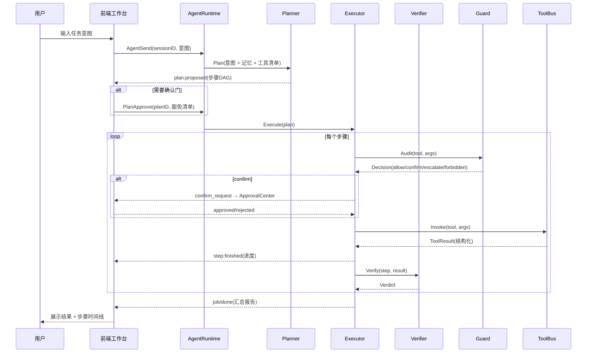
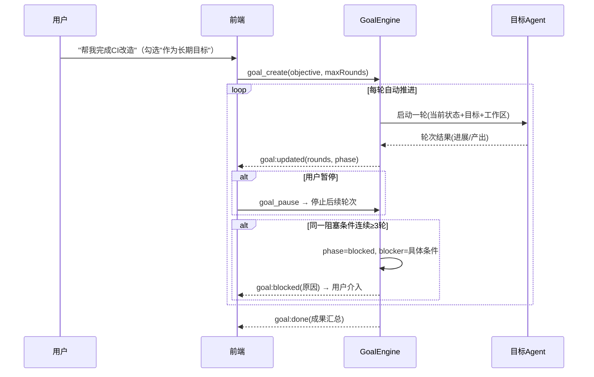
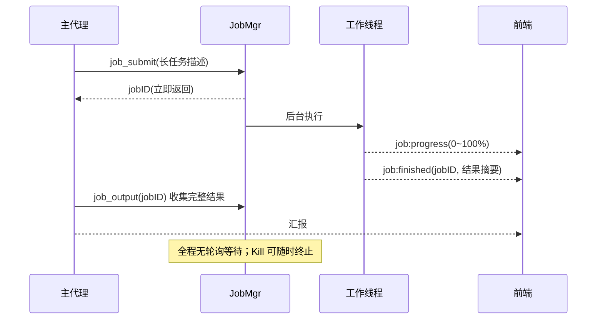
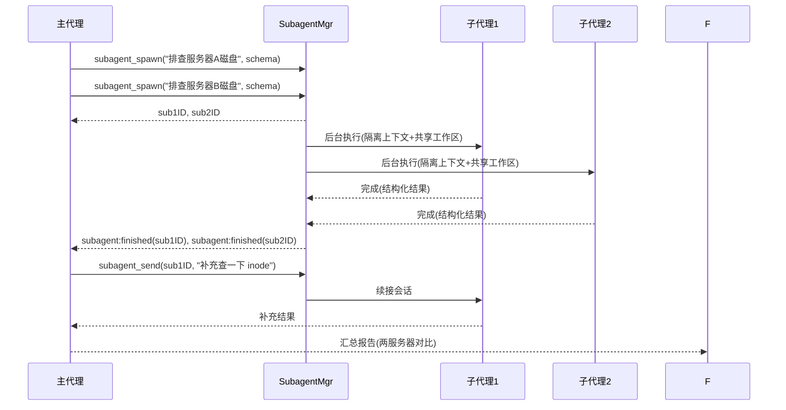
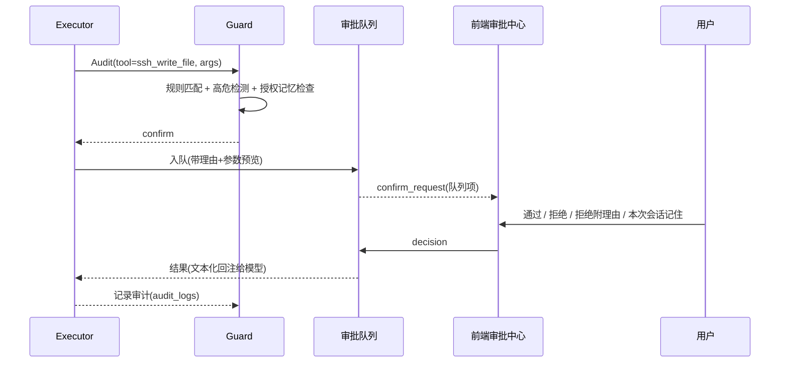

# xAgent 2.0 — AI 智能体升级改造设计文档（结合 Harness 思想）

| 项目 | 内容 |
| :--- | :--- |
| 文档版本 | v0.1（草案） |
| 适用范围 | xClient `agent/` 后端、`app_agent.go` 绑定层、`frontend/src/pages/agent/` 前端 |
| 指导思想 | DeepSeek Harness（DSH）类智能体运行时哲学：**工具即边界、沙箱渐进授权、后台作业、计划-执行-验证、目标驱动、子代理委派、工作流编排、技能生态、显式上下文、全程可观测** |
| 目标形态 | 从"单会话问答 + 工具调用"升级为"**任务型多智能体工作台**" |

---

## 1. 背景与目标

### 1.1 现状

xClient 已内置一个可用的 AI 智能运维助手（下称 **xAgent 1.x**），基于 CloudWeGo Eino `v0.9.13` + `eino-ext` OpenAI 兼容模型适配，能力包括：

- 多轮对话（OpenAI / DeepSeek / 通义千问 / Ollama 兼容接口），支持 DeepSeek 思考模式与 `reasoning_effort`；
- 工具调用：工作目录文件操作（list / read / write / delete / search）、联网搜索、SSH 远程运维（系统概况、命令执行、SFTP 文件、进程、Docker）；
- 权限审查引擎（`permission.go`）：三级策略（read_only / user_confirm / forbidden）+ 高危 Shell 命令正则拦截 + 前端二次确认；
- 上下文压缩（滑动窗口 / LLM 摘要）、会话历史 JSON 本地存储、流式输出与工具事件推送到前端。

### 1.2 当前瓶颈（升级的动因）

| # | 瓶颈 | 代码现状 |
| :--- | :--- | :--- |
| B1 | **单一线性会话**：所有请求都是"一问一答"，没有"任务"概念，长任务无法后台运行、暂停、恢复、断点续跑 | `agent/agent.go` 中 `StreamChat` 为一次性阻塞流 |
| B2 | **单例 Agent**：`DefaultManager` 全局唯一 runner，多会话共享同一模型实例与工具表，无法隔离上下文与配置 | `agent.go:60` `var DefaultManager = NewAgentManager()` |
| B3 | **无规划能力**：模型直接边想边调工具，缺少"先计划、用户确认、再执行、最后验证"的结构化循环 | `adk.NewChatModelAgent` 单层 ReAct |
| B4 | **无委派能力**：复杂任务（如"排查 3 台服务器并汇总"）只能在一个上下文里线性做，无法并行、无法隔离子任务 | 无 subagent 概念 |
| B5 | **多协议能力未打通**：客户端已具备 Redis / MySQL / MongoDB / SQLite / MQTT / HTTP 引擎，但智能体只能操作文件与 SSH，数据库诊断能力空白 | `tools.go` / `tools_ssh.go` 工具集 |
| B6 | **权限模型粗糙**：每次写操作都弹窗、无"会话内授权记忆"、无审计留痕、无"拒绝后带理由升级重试"机制 | `permission.go` 单点确认 |
| B7 | **无持久化任务/记忆体系**：历史是单一 JSON 文件（`ai_agent_history.json`），无作业表、无目标表、无审计表、无技能库 | `storage.go` |
| B8 | **事件协议脆弱**：前端事件为字符串拼接（`agent:chunk:<id>`），无类型化 schema，扩展一个事件要改 4 处 | `app_agent.go` + `AiAgentPanel.tsx` |

### 1.3 升级目标

**总体目标**：以 Harness 思想为纲，把 xAgent 从"聊天机器人"升级为"**可计划、可执行、可验证、可委派、可恢复、可审计**"的任务型多智能体工作台，并打通 xClient 全部协议能力，使其成为真正的"开发运维副驾驶"。

量化验收指标（目标值，最终以试点数据校准）：

| 指标 | 现状 | 目标 |
| :--- | :--- | :--- |
| 单任务最长执行时长 | 受限于单次请求（分钟级） | 后台作业无上限，可跨会话恢复 |
| 并行子任务数 | 1 | ≥ 8 |
| 可操作协议数 | SSH + 文件 + 搜索 | SSH + 文件 + 搜索 + Redis + MySQL + MongoDB + SQLite + MQTT + HTTP |
| 高危操作拦截率 | 正则覆盖有限 | 正则 + 语义规则双通道，误放率趋近 0 |
| 审计完整性 | 无 | 每次工具调用均有 input / output / 决策 / 耗时留痕 |
| 上下文利用率 | 规则截断 | 分层记忆 + 按需召回，长会话质量不衰减 |

---

## 2. 什么是 Harness 思想（本设计的指导思想）

> Harness 直译为"马具/挽具"：**不追求让模型本身变强，而是通过模型外部的工程脚手架，把模型可靠地"套"在真实世界之上**。模型只负责推理与决策，世界的进出口全部由 Harness 定义好的、带 schema、带权限、带审计的接口接管。

### 2.1 十条核心原则

| # | 原则 | 含义 | 在本设计中的落地 |
| :--- | :--- | :--- | :--- |
| P1 | **工具即边界** | 模型不直接触碰系统，只能调用经过严格 JSON Schema 定义、描述精确、返回结构化结果的工具 | 工具总线 + Schema 注册表（§5.9） |
| P2 | **沙箱与渐进授权** | 默认拒绝，按需放行；写操作前必须读（read-before-write）；越权时允许"带理由的一次性升级重试" | 权限策略引擎（§5.10） |
| P3 | **后台作业** | 一切长耗时操作都是带 id、状态、可查询、可终止的作业；禁止轮询等待，完成即通知 | 作业系统（§5.1.2） |
| P4 | **计划-执行-验证** | 先出计划、过确认门，再执行，最后验证结果并汇报；执行失败要调查而非盲目重试 | 编排层（§5.2） |
| P5 | **目标驱动** | 长任务固化为持久化目标，带轮次上限、可暂停/恢复、连续失败才判定阻塞 | 目标引擎（§5.3） |
| P6 | **子代理委派** | 主代理只编排，重活委派给上下文隔离的子代理；后台运行、完成通知、可继续对话、可中断 | 子代理体系（§5.4） |
| P7 | **工作流编排** | 允许用脚本把多智能体、多阶段工作编排成流水线（阶段 / 并行 / 屏障），可复用 | 工作流引擎（§5.5） |
| P8 | **技能生态** | 可复用的任务指令包按需加载，替代把"怎么做"写死在系统提示词里 | 技能体系（§5.6） |
| P9 | **显式上下文** | 系统提示注入当前时间、工作区、连通会话等事实；上下文分层管理（工作/情节/语义记忆） | 记忆层（§5.7） |
| P10 | **全程可观测** | 类型化事件总线 + 全量审计日志 + 结构化结果，任何一步都可回放 | 事件与审计（§5.1.3、§5.10） |

### 2.2 成熟度模型（"更高层次"的阶梯定义）

| 层级 | 名称 | 特征 | 对应现状 |
| :--- | :--- | :--- | :--- |
| L1 | 对话式助手 | 单会话、单模型、简单工具调用 | **xAgent 1.x（当前）** |
| L2 | 任务式工作台 | 任务/作业体系、计划-执行-验证、权限策略引擎、审计 | Phase 1–2 |
| L3 | 协作式智能体 | 子代理委派、目标引擎、工作流编排、多模型路由 | Phase 3 |
| L4 | 自主式副驾驶 | 分层记忆、技能生态、跨会话自主推进、自愈与复盘 | Phase 4 |

本设计的目标是**完整到达 L3，并为 L4 预留接口**。

---

## 3. 现状分析（基于现有代码）

### 3.1 现有架构

```
Frontend (AiAgentPanel.tsx / AiAgentTab.tsx)
   │  Wails Bindings (app_agent.go)
   ▼
agent.DefaultManager (单例) ── eino ADK Runner (ChatModelAgent, MaxIterations=100)
   ├─ openai.ChatModel (BaseURL/APIKey/Model/Temperature/Thinking/ReasoningEffort)
   ├─ WorkspaceManager (工作目录 + 确认通道 + 事件回调)
   ├─ PermissionGuard (规则表 + 高危命令正则 + 包装器 PermissionWrappedTool)
   ├─ Tools: workspace_* / web_search / ssh_*
   └─ Storage (单 JSON 文件会话历史)
```

### 3.2 能力盘点

| 能力域 | 现有实现 | 升级去向 |
| :--- | :--- | :--- |
| 模型通信 | `openai.NewChatModel` 流式 | 保留为默认 worker，抽象为 `ModelProvider`（§5.8） |
| 工具调用 | Eino `utils.InferTool` 推断 Schema | 保留推断机制，增加"Schema 注册表 + 结构化结果契约"（§5.9） |
| 权限 | `PermissionGuard` 三级 + 正则 | 升级为策略引擎（§5.10），保留并迁移现有规则 |
| 上下文压缩 | 滑动窗口 / LLM 摘要 | 升级为分层记忆（§5.7） |
| 会话存储 | `ai_agent_history.json` | 迁移至 SQLite（§5.1.4） |
| 事件推送 | `agent:chunk:<id>` 等字符串事件 | 升级为类型化事件总线（§5.1.3） |

### 3.3 差距分析（现状 × 十条原则）

| 原则 | 现状评级 | 差距 |
| :--- | :--- | :--- |
| P1 工具即边界 | ◐ | 有 schema，但工具 I/O 未统一契约（输出自由字符串），无工具版本管理 |
| P2 沙箱与渐进授权 | ◐ | 有路径越界检查与确认，但无 read-before-write、无"带理由升级重试"、无授权记忆 |
| P3 后台作业 | ✗ | 完全缺失，长任务只能阻塞 |
| P4 计划-执行-验证 | ✗ | 无规划器与验证器，无计划确认门 |
| P5 目标驱动 | ✗ | 无目标持久化 |
| P6 子代理委派 | ✗ | 完全缺失 |
| P7 工作流编排 | ✗ | 完全缺失 |
| P8 技能生态 | ✗ | 系统提示词硬编码 |
| P9 显式上下文 | ◐ | 有时间/工作区注入，无记忆分层 |
| P10 全程可观测 | △ | 有 tool_start/tool_event 推送，无审计留痕、无作业状态流 |

---

## 4. 目标架构总览

### 4.1 分层架构

```
┌────────────────────────────────────────────────────────────────────┐
│  Frontend  —  AI 工作台 (Chat / Plan / Job / Subagent / Approval / Audit) │
└───────────────┬────────────────────────────────────────────────────┘
                │ Wails Bindings (app_agent.go 重构为薄绑定层)
┌───────────────▼────────────────────────────────────────────────────┐
│  Orchestration 编排层                                               │
│   Planner ── PlanGate ── Executor ── Verifier                        │
│   GoalEngine │ SubagentMgr │ WorkflowEngine │ SkillsRegistry         │
├─────────────────────────────────────────────────────────────────────┤
│  Harness Core 运行时内核                                             │
│   SessionMgr │ JobMgr │ EventBus(类型化) │ Router(模型路由)          │
│   Memory(分层) │ Guard(策略引擎) │ Store(SQLite)                     │
├─────────────────────────────────────────────────────────────────────┤
│  Tool Bus 工具总线  (Schema 注册表 + 结构化结果契约)                  │
│   workspace_* │ ssh_* │ web_search │ db_* (redis/mysql/mongo/sqlite) │
│   mqtt_* │ http_* │ job_* │ subagent_* │ goal_* │ skill_* │ memory_* │
├─────────────────────────────────────────────────────────────────────┤
│  Engine 领域引擎 (xClient 既有能力，只读优先接入)                     │
│   ssh/ │ redis/ │ db/ │ mongo/ │ proto/ │ core/                      │
└─────────────────────────────────────────────────────────────────────┘
```

### 4.2 模块职责表

| 模块 | 职责 | 关键接口 |
| :--- | :--- | :--- |
| `Session` | 会话状态机：创建/配置/运行/停止；持有自己的 Agent 实例与上下文 | `NewSession(cfg) → *Session` |
| `JobMgr` | 后台作业：提交/状态/输出/终止/收集；完成即发通知 | `Submit(run) → jobID`、`Output(jobID)`、`Kill(jobID)` |
| `EventBus` | 类型化事件发布订阅（取代字符串拼接） | `Emit(event Event)`、`Subscribe[T]()` |
| `Planner` | 将用户意图分解为步骤计划（DAG），产出结构化计划 | `Plan(ctx, goal) → *Plan` |
| `Executor` | 按计划执行步骤：工具调用、子代理委派、作业提交 | `Execute(ctx, step) → *StepResult` |
| `Verifier` | 校验执行结果（成功/偏差/需重试），驱动自愈 | `Verify(ctx, step, result) → Verdict` |
| `GoalEngine` | 目标持久化、轮次推进、暂停/恢复、阻塞判定 | `Create/Resume/Update/Pause/Blocked` |
| `SubagentMgr` | 子代理生命周期：spawn（隔离上下文）/ 后台运行 / 通知 / 继续对话 / 中断 | `Spawn(prompt) → subID`、`Send(subID, msg)`、`Interrupt(subID)` |
| `WorkflowEngine` | 脚本化多代理编排：阶段、并行、屏障、结构化结果校验 | `Run(script, meta)` |
| `SkillsRegistry` | 技能包注册、按需加载、注入系统提示 | `Load(name) → Skill` |
| `Memory` | 工作记忆（上下文窗口）/ 情节记忆（会话摘要）/ 语义记忆（向量检索） | `Recall(ctx, query) → []Memory` |
| `Router` | 多模型管理：默认 worker、规划/验证专用模型、按阶段覆盖 provider | `Resolve(role) → Model` |
| `ToolBus` | 工具注册、Schema 注册表、结构化结果契约、事件钩子 | `Register(t Tool)`、`Invoke(name, args)` |
| `Guard` | 策略引擎：分级授权、审计、授权记忆、升级重试 | `Audit(ctx, call) → Decision` |
| `Store` | SQLite 持久化：会话/作业/目标/子代理/审计/技能/记忆 | `*Store` 数据访问层 |

### 4.3 目录结构规划

```
agent/
├── runtime.go            // AgentRuntime：全局装配（会话、事件、存储、路由）
├── session.go            // 会话状态机（替换单例 DefaultManager 的职责）
├── job/
│   ├── job.go            // Job 实体与状态机
│   └── manager.go        // 作业管理器（后台执行、进度推送、结果收集）
├── planner/              // 规划器 + 计划模型
├── executor/             // 执行器
├── verifier/             // 验证器
├── goal/                 // 目标引擎
├── subagent/             // 子代理管理
├── workflow/             // 工作流引擎（脚本 DSL）
├── skills/               // 技能包注册与加载
├── memory/               // 分层记忆
├── router/               // 模型路由与 Provider 抽象
├── tools/
│   ├── bus.go            // 工具总线
│   ├── workspace.go      // 迁移自 tools.go
│   ├── ssh.go            // 迁移自 tools_ssh.go
│   ├── websearch.go      // 迁移自 tools_websearch.go
│   ├── db.go             // 新增：redis/mysql/mongo/sqlite 只读诊断工具
│   ├── mqtt.go           // 新增：MQTT 工具
│   ├── http.go           // 新增：HTTP/WS 工具
│   ├── job.go            // 新增：作业控制工具（submit/status/output/kill）
│   ├── subagent.go       // 新增：委派工具（spawn/send/interrupt/list）
│   ├── goal.go           // 新增：目标工具（create/resume/status/blocked）
│   ├── skill.go          // 新增：技能加载工具
│   └── memory.go         // 新增：记忆读写工具
├── guard/                // 权限策略引擎（升级自 permission.go）
├── store/                // SQLite 持久化（升级自 storage.go）
└── events/               // 类型化事件定义

frontend/src/pages/agent/
├── AiAgentPanel.tsx      // 保留：工作台入口/路由
├── ChatView.tsx          // 对话视图（迁移现有消息流）
├── PlanView.tsx          // 计划视图（步骤 DAG、确认门按钮）
├── JobPanel.tsx          // 作业面板（状态/进度/输出/终止）
├── SubagentTree.tsx      // 子代理树（层级、状态、消息）
├── ApprovalCenter.tsx    // 审批中心（队列、理由、授权记忆开关）
├── AuditLogView.tsx      // 审计日志视图
└── GoalView.tsx          // 目标视图（轮次、进度、阻塞）
```

### 4.4 关键设计决策（D1–D6）

| 决策 | 内容 | 理由 | 代价与对策 |
| :--- | :--- | :--- | :--- |
| **D1** | 单例 Runner → **每会话独立 Agent 实例**，共享工具注册表与模型 Provider | 多会话隔离配置与上下文，互不污染 | 内存开销可控（实例为轻量组合）；用对象池复用模型 |
| **D2** | JSON 文件 → **SQLite**（复用 `modernc.org/sqlite`，go.mod 已依赖） | 多实体（会话/作业/目标/审计/记忆）需要关系查询与并发写 | 增加迁移脚本（Phase 0 把历史 JSON 导入 sessions 表） |
| **D3** | 字符串事件 → **类型化事件总线**（`Event{Type, SessionID, Payload}` + Go 泛型订阅） | 事件可扩展、可校验、可审计，前端按类型分发 | 前端订阅逻辑需重构（一次性改造，Phase 0 完成） |
| **D4** | 单点确认 → **策略引擎 + 授权记忆 + 升级重试** | 减少打扰、防误操作、支持"带理由升级"的 Harness 语义 | 需设计"会话内授权记忆"过期与撤销机制 |
| **D5** | 单一 ChatModel → **Router 多模型**（规划/执行/验证可不同模型与 provider） | 规划用强推理模型、验证用廉价模型，成本与质量兼得 | Router 需缓存与降级策略（provider 失败自动降级默认模型） |
| **D6** | 规则截断 → **分层记忆**（working / episodic / semantic） | 长会话质量不衰减，跨会话可召回事实 | 语义记忆需嵌入模型（默认本地 hash 近似检索，向量检索为可选增强） |

---

## 5. 核心模块设计

### 5.1 Harness Core（运行时内核）

#### 5.1.1 会话与运行时（Session / Runtime）

```go
type Session struct {
    ID        string
    State     SessionState   // idle | planning | waiting_approval | executing | verifying | done | failed | stopped
    Agent     *AgentInstance // 独立于其他会话
    Workspace string         // 会话绑定的工作目录（可覆盖全局）
    Policy    *PolicySet     // 会话级权限策略
    CreatedAt time.Time
}

type AgentInstance struct {
    Model  router.ResolvedModel
    Tools  []*tools.RegisteredTool
    Memory *memory.WorkingMemory
}
```

- `AgentRuntime` 取代 `DefaultManager` 成为装配根：持有 `SessionMgr / JobMgr / EventBus / Router / Store / Guard / ToolBus`，并在 `App.OnStartup` 中初始化一次。
- `app_agent.go` 重构为**薄绑定层**：只做参数编解码与事件转发，业务逻辑全部下沉到 `agent` 包。

#### 5.1.2 作业系统（Job）

作业是"后台任务"的一等公民，完全镜像 Harness 的作业语义：

```go
type Job struct {
    ID         string
    SessionID  string
    Kind       string        // "chat" | "tool" | "subagent" | "workflow" | "goal_round"
    State      JobState      // pending | running | waiting_approval | completed | failed | killed
    Progress   float64       // 0~1
    Output     []JobOutputChunk // 增量输出（可重复读取）
    Error      string
    CreatedAt, StartedAt, FinishedAt time.Time
}
```

关键语义：
- `Submit(run func(ctx, emit ProgressFunc)) → jobID`：立即返回，后台 goroutine 执行；
- `Output(jobID)`：读取增量输出（读取后游标推进，模拟 `job_output` 的"仅返回新增"语义）；
- `Kill(jobID)`：通过 `context.WithCancel` 终止，终止态统一为 `killed`；
- **完成即通知**：作业终态通过事件总线推 `job:finished`，前端/主代理收到通知后按需收集，**禁止轮询等待**；
- 作业与"会话停止"解耦：`StopChat` 只停当前回合，作业仍可后台继续。

#### 5.1.3 类型化事件总线

```go
type Event struct {
    Type      EventType // ChatChunk | ReasoningChunk | ToolStart | ToolEvent | ConfirmRequest |
                        // JobCreated | JobProgress | JobFinished | SubagentCreated | SubagentFinished |
                        // PlanProposed | PlanApproved | StepStarted | StepFinished | GoalUpdated | Notice | Error
    SessionID string
    Payload   any        // 由 Type 对应的 struct 承载，前端按 Type 反序列化
}
```

- 事件定义集中在 `agent/events/`，前端 `api.ts` 生成类型化订阅函数（`onChatChunk(id, cb)`），消除字符串拼接散落。
- 每条事件附带 `TraceID`（一次用户请求一条链路），审计可回放。

#### 5.1.4 持久化存储（Store / SQLite）

见 §6 数据模型。迁移策略：Phase 0 将现有 `ai_agent_history.json` 导入 `sessions.messages` 表，保留只读兼容接口一个版本。

### 5.2 编排层：计划-执行-验证（P4）

这是 xAgent 2.0 的**核心循环**，取代 1.x 的裸 ReAct：

```
用户意图 ──► Planner ──► Plan(步骤 DAG) ──► [PlanGate 确认门] ──► Executor
                                                                    │
       汇报 ◄── Verifier ◄── 结果校验 ◄── 步骤结果(工具/子代理/作业) ◄┘
```

#### 5.2.1 Planner

- 输入：用户意图 + 会话记忆 + 可用工具清单（含 Schema 摘要）+ 当前事实（时间/工作区/连通会话）；
- 输出：结构化 `Plan`：

```go
type Plan struct {
    ID          string
    Objective   string
    Steps       []PlanStep    // 有序或 DAG（依赖边）
    RiskLevel   RiskLevel     // 低/中/高：由步骤工具类别与权限决策汇总
    NeedConfirm bool          // 是否过确认门
}
type PlanStep struct {
    ID          string
    Action      string        // tool_call | subagent | job | workflow | ask_user
    ToolName    string        // Action=tool_call 时
    Args        json.RawMessage
    DependsOn   []string
    ExpectedOut string        // 期望产出，供 Verifier 比对
}
```

- 规划模型：默认复用主模型，可通过 Router 指定更强推理模型（D5）；
- 规划结果同时推 `plan:proposed` 事件，前端 PlanView 渲染步骤卡片。

#### 5.2.2 PlanGate（计划确认门）

- 判定规则：`RiskLevel == high` 或任一步骤命中 `user_confirm` 以上权限 → 必须人工确认；
- 纯只读任务（如"查下这几台服务器的磁盘"）自动放行，直达执行；
- 确认门支持**整单确认 / 单步豁免**：用户可豁免某一已知安全步骤，剩余仍走审批。

#### 5.2.3 Executor

- 按 DAG 拓扑序执行步骤；并行无依赖步骤（受 `MaxParallel` 限制，默认 4）；
- 步骤结果统一为 `StepResult{OK bool, Output any, Err error}`；
- 工具调用统一走 `ToolBus.Invoke`（内部过 Guard）；长任务自动转为 Job 后台执行；
- 步骤失败不盲目重试：先 `Verifier` 判定，再决定重试 / 换招 / 询问用户（P4："调查而非盲试"）。

#### 5.2.4 Verifier

- 校验项：结果与 `ExpectedOut` 的符合度、退出码/错误语义、副作用残留（如是否产生了意外文件）；
- 输出 `Verdict{Pass | Fail | Partial, Reason, FixSuggestion}`；
- `Fail` 时驱动 Executor 选择修复路径；`Partial` 时向用户汇报完成度与遗留项。

### 5.3 目标引擎（Goal Engine，P5）

面向"跨回合、跨会话的长任务"，如"帮我完成这个项目的 CI 改造"。

```go
type Goal struct {
    ID          string
    Objective   string
    Phase       string        // plan | execute | verify | done | blocked
    Rounds      int           // 已完成的自动推进轮次
    MaxRounds   int           // 轮次上限
    Revision    int           // 乐观锁版本（每次 update 递增）
    Blocker     string        // 阻塞原因（连续 N 轮同一阻塞条件才置 blocked）
    Workspace   string        // 目标绑定的共享工作区（跨轮持久记忆）
    CreatedAt, UpdatedAt time.Time
}
```

关键语义（对齐 Harness 目标工具）：
- **轮次推进**：每轮由目标自身的 agent 实例执行"取当前状态 → 推进 → 汇报结果"，结果作为下一轮输入；
- **暂停/恢复**：用户可暂停；会话重启后目标仍可恢复（`resume` 必须显式触发）；
- **阻塞判定**：仅当**同一具体阻塞条件连续 ≥ 3 轮**才置 `blocked`，且必须记录具体阻塞条件（困难/不确定不算阻塞）；
- 目标工具暴露给主代理：`goal_create / goal_status / goal_resume / goal_pause / goal_blocked`。

### 5.4 子代理体系（Subagent，P6）

主代理只做编排，重活委派。语义对齐 Harness 子代理：

| 能力 | 设计 |
| :--- | :--- |
| 隔离上下文 | 每个子代理独立会话，**不共享父对话上下文**，只携带任务 prompt + 共享工作区路径 |
| 后台默认 | `Spawn` 立即返回 `subID`，后台执行；终态通过事件 `subagent:finished` 通知父级 |
| 继续对话 | `Send(subID, msg)` 续接同一子代理会话（用于追问/补料） |
| 中断 | `Interrupt(subID)` 停止其当前回合；已排队消息保留，可后续继续 |
| 树形结构 | 子代理可再 spawn 孙代理；前端 SubagentTree 渲染层级 |
| 结构化结果 | Spawn 时可声明期望 JSON Schema，子代理返回校验过的结构化对象，失败返回 null |

前端视角：主代理 = 编排者，子代理 = 工作节点，全部在 SubagentTree 中可见、可点开查看其会话。

### 5.5 工作流引擎（Workflow Engine，P7）

面向"可复用的多智能体流水线"（如：批量巡检脚本、发布检查单）。提供轻量 DSL（对齐 Harness workflow 语义）：

- `agent(prompt, {schema, model, phase})`：跑一个子代理到完成，可校验结构化结果；
- `pipeline(items, ...stages)`：每个 item 依次过阶段，**阶段间无屏障**，任一步骤失败只淘汰该 item；
- `parallel(thunks)`：并发执行并等待全部（仅当真正需要全部结果时才用屏障）；
- `phase(title)` / `log(msg)`：进度叙述；
- 工作流可保存为可复用脚本（存入 `workflows` 表），由 `workflow_run` 工具触发；
- 约束对齐：无文件系统/网络/定时器权限，工作全部由代理完成，脚本只做编排。

### 5.6 技能体系（Skills，P8）

- 技能 = 命名 + 描述 + 指令包（markdown）+ 适用条件 + 依赖工具白名单；
- 存储：`skills/` 目录或 SQLite `skills` 表；用户可导入自建技能；
- 加载机制：主代理/规划器按任务语义**按需加载**技能指令注入系统提示，替代把"怎么做"写死在 `AiSystemPrompt`；
- 内置技能规划：
  - `server-troubleshooting`（服务器排障 SOP：系统概况 → 日志 → 进程 → 资源 → 结论）
  - `db-health-check`（数据库健康巡检：连接 → 慢查询 → 空间 → 复制状态）
  - `security-audit`（安全审计：高危命令识别、权限复核、审计回放）
  - `release-checklist`（发布检查单）

### 5.7 记忆与上下文管理（Memory，P9）

| 层 | 内容 | 实现 |
| :--- | :--- | :--- |
| Working（工作记忆） | 当前回合上下文窗口 | 会话内消息队列 + Token 预算（沿用 1.x 的滑动窗口/摘要，升级为自动） |
| Episodic（情节记忆） | 每次会话的摘要沉淀 | 会话结束时自动生成摘要，写入 `memories` 表（复用 1.x 的 LLM 摘要逻辑） |
| Semantic（语义记忆） | 事实/决策/教训的长期存储 | 键值 + 全文索引检索（SQLite FTS5）；向量检索（可选增强，接口预留） |

- 注入规则：每回合开始时，由 `Memory.Recall(当前意图)` 召回相关情节/语义记忆，作为系统提示附加段；
- 记忆工具：`memory_save / memory_recall`，供主代理主动读写（如"记住这个项目的部署路径"）；
- 保留 1.x 的显式上下文注入：当前系统时间、工作目录、已连通 SSH 会话清单（`agent.go:185-207` 逻辑迁移至 session 组装层）。

### 5.8 模型路由（Router，D5）

```go
type Provider interface {
    Chat(ctx, req) (stream, error)
}
type Router struct {
    Default   Provider          // 兼容现有 openai.ChatModel 配置
    Planner   Provider          // 可选：规划专用
    Verifier  Provider          // 可选：验证专用（廉价模型）
    Overrides map[string]Provider // 按工作流阶段覆盖
}
```

- 配置面：`AiAgentTab` 增加"规划模型 / 验证模型（可选）"字段，缺省回退 Default；
- 降级策略：任一 provider 调用失败自动降级 Default 并记审计；
- 保留现有 Thinking / ReasoningEffort / Temperature / 多模态开关，迁移到 `ModelProfile` 结构。

### 5.9 工具总线与多协议能力（P1 + B5）

#### 5.9.1 工具注册表

```go
type RegisteredTool struct {
    Name        string
    Description string
    Schema      *jsonschema.Schema   // 入参 Schema（InferTool 推断后固化注册）
    ResultShape ResultShape          // 结构化结果契约：{type, fields, max_bytes}
    Permission  guard.Level          // 默认权限等级
    Timeout     time.Duration
    OnStart, OnEvent func(...)       // 事件钩子
}
```

- 所有工具输出统一为 `ToolResult{OK, Data(any), Meta}`，禁止自由字符串；
- 大输出截断策略：默认 200KB（沿用 1.x read_file 的截断），结构化字段可配置。

#### 5.9.2 工具清单规划

**保留并迁移（1.x 已有）：**

| 工具 | 说明 | 权限 |
| :--- | :--- | :--- |
| `workspace_list_dir / read_file / write_file / delete / search` | 工作区文件操作 | 读只读 / 写确认 |
| `web_search` | 联网搜索 | 只读 |
| `ssh_list_sessions / get_system_info / list_dir / read_file / list_processes / list_containers` | 远程只读运维 | 只读 |
| `ssh_exec_command / write_file / delete_file / upload_file / download_file` | 远程写与执行 | 确认 / 高危拦截 |

**新增（打通 xClient 全协议，B5）：**

| 工具 | 说明 | 默认权限 |
| :--- | :--- | :--- |
| `db_redis_keys / db_redis_get / db_redis_info / db_redis_slowlog` | Redis 只读诊断（复用 `redis/` 引擎） | 只读 |
| `db_mysql_query_readonly / db_mysql_schema / db_mysql_status / db_mysql_processlist` | MySQL 只读查询与诊断（`db/mysql.go`） | 只读；SQL 白名单（仅 SELECT/SHOW/DESCRIBE/EXPLAIN） |
| `db_mongo_find / db_mongo_aggregate / db_mongo_health` | MongoDB 只读查询（`mongo/`） | 只读 |
| `db_sqlite_query_readonly` | SQLite 只读查询 | 只读 |
| `mqtt_publish / mqtt_subscribe_once` | MQTT 消息操作（`proto/` + mqtt 引擎） | 确认 |
| `http_request_readonly` | GET 请求（`proto/httpapi.go`），禁止写方法 | 只读；域名白名单 |
| `job_submit / job_status / job_output / job_kill` | 作业控制（供主代理调度长任务） | 确认 |
| `subagent_spawn / subagent_send / subagent_interrupt / subagent_list` | 委派控制 | 确认 |
| `goal_create / goal_status / goal_resume / goal_pause` | 目标控制 | 确认 |
| `skill_load / skill_list` | 技能加载 | 只读 |
| `memory_save / memory_recall` | 记忆读写 | 读只读 / 写确认 |
| `ask_user` | 向用户提问获取澄清（复用现有 `agent:ask` 通道） | 只读 |

**数据库只读执行器（重点设计）**：MySQL 查询工具必须经过三层防护 —— ① SQL 语法白名单（仅 `SELECT/SHOW/DESCRIBE/EXPLAIN`，拒绝多语句与事务控制）；② 结果行数上限（默认 100 行）；③ 超时熔断（默认 10s）。任何写语句走独立的 `db_mysql_exec_approved` 工具（`forbidden` 起步，需用户在审批中心单独开启）。

### 5.10 安全与权限治理（Guard 升级，P2）

#### 5.10.1 授权等级（对齐 Harness 沙箱语义）

| 等级 | 语义 | 行为 |
| :--- | :--- | :--- |
| `allow` | 自动放行 | 只读类工具默认 |
| `confirm` | 需人工确认 | 写操作默认；支持**会话内授权记忆**（"本次会话内记住"） |
| `escalate` | 拒绝 + 可升级重试 | 越权操作返回拒绝理由，提示用户"授权后带理由重试一次"（one-shot escalation，仿 DSH sandbox_permissions） |
| `forbidden` | 硬拦截 | 高危命令/写库/写方法；记录审计，可配置放行例外 |

#### 5.10.2 策略引擎

- 规则表从 `permission.go` 的 map 升级为**可热加载策略**：`ToolName × 动作模式 × 路径前缀 × 命令特征` → 等级；
- 高危 Shell 拦截从"正则列表"升级为"正则 + 语义规则双通道"：正则负责确定性匹配，语义规则（LLM 分类，仅对正则未命中且属 write 类命令触发）负责召回未知高危命令；
- **路径沙箱**：沿用 `ResolvePath` 的工作区锚定，新增"工作区外路径 = escalate"语义（拒绝并提示授权升级），补强 read-before-write：写文件前若目标已存在，工具结果附上当前内容首 200 字符供模型确认；
- **审计**：每次工具调用记录 `{session, trace_id, tool, input, decision, output_head, duration, timestamp}` 到 `audit_logs` 表，前端 AuditLogView 可检索回放。

#### 5.10.3 审批中心

- 取代 1.x 的即时弹窗：确认请求进入**审批队列**（可积压多条），前端 ApprovalCenter 统一处理；
- 支持决策：通过 / 拒绝 / 拒绝并附理由 / 本次会话内记住（授权记忆，默认 30 分钟过期，可在设置中调整或立即撤销）；
- 审批决策回流为工具结果文本，模型据此调整策略（拒绝后模型必须解释并换方案，不得原样重试——对齐"拒绝即最终"的沙箱纪律）。

---

## 6. 数据模型设计（SQLite）

库：`%APPDATA%/xClient/xagent.db`（`modernc.org/sqlite`，无 CGO）。

```sql
-- 会话
CREATE TABLE sessions (
    id          TEXT PRIMARY KEY,
    title       TEXT,
    workspace   TEXT,
    settings    TEXT,             -- JSON：模型配置快照
    created_at  INTEGER, updated_at INTEGER
);

-- 会话消息（迁移自 ai_agent_history.json）
CREATE TABLE messages (
    id          INTEGER PRIMARY KEY AUTOINCREMENT,
    session_id  TEXT NOT NULL REFERENCES sessions(id),
    role        TEXT NOT NULL,
    content     TEXT,
    reasoning   TEXT,
    tool_calls  TEXT,             -- JSON
    process_steps TEXT,           -- JSON
    created_at  INTEGER
);

-- 作业
CREATE TABLE jobs (
    id          TEXT PRIMARY KEY,
    session_id  TEXT,
    kind        TEXT,
    state       TEXT,
    progress    REAL,
    error       TEXT,
    created_at  INTEGER, started_at INTEGER, finished_at INTEGER
);
CREATE TABLE job_output (
    job_id  TEXT NOT NULL,
    seq     INTEGER NOT NULL,
    chunk   TEXT,
    PRIMARY KEY (job_id, seq)
);

-- 目标
CREATE TABLE goals (
    id          TEXT PRIMARY KEY,
    objective   TEXT NOT NULL,
    phase       TEXT,
    rounds      INTEGER DEFAULT 0,
    max_rounds  INTEGER,
    revision    INTEGER DEFAULT 1,
    blocker     TEXT,
    workspace   TEXT,
    state       TEXT,             -- JSON：跨轮共享状态
    created_at  INTEGER, updated_at INTEGER
);

-- 子代理
CREATE TABLE subagents (
    id          TEXT PRIMARY KEY,
    parent_id   TEXT,             -- 父代理（NULL=根会话）
    session_id  TEXT,
    prompt      TEXT,
    state       TEXT,
    result      TEXT,             -- JSON 结构化结果
    created_at  INTEGER, finished_at INTEGER
);

-- 审计
CREATE TABLE audit_logs (
    id          INTEGER PRIMARY KEY AUTOINCREMENT,
    trace_id    TEXT,
    session_id  TEXT,
    tool        TEXT,
    input       TEXT,
    decision    TEXT,
    output_head TEXT,
    duration_ms INTEGER,
    created_at  INTEGER
);

-- 记忆
CREATE TABLE memories (
    id          INTEGER PRIMARY KEY AUTOINCREMENT,
    kind        TEXT,             -- episodic | semantic
    content     TEXT,
    tags        TEXT,
    source      TEXT,             -- session/goal 来源
    created_at  INTEGER
);
CREATE VIRTUAL TABLE memories_fts USING fts5(content, tags);

-- 技能 / 工作流
CREATE TABLE skills (
    name TEXT PRIMARY KEY, description TEXT, instructions TEXT, tools TEXT
);
CREATE TABLE workflows (
    name TEXT PRIMARY KEY, description TEXT, script TEXT, version INTEGER
);
```

---

## 7. 关键流程设计

### 7.1 对话式任务流（日常主路径）



### 7.2 长目标轮次流（P5）



### 7.3 后台作业流（P3）



### 7.4 子代理委派流（P6）



### 7.5 审批流（P2/P10）



---

## 8. 前端交互设计

### 8.1 工作台布局（AiAgentPanel 重构）

```
┌──────────────────────────────────────────────────────────────┐
│  AI 工作台                                                  │
│  ┌──────────┬──────────────────────────────┬───────────────┐ │
│  │ 会话列表  │  ChatView(对话流+步骤时间线)  │  右侧面板      │ │
│  │ + 目标    │                              │  PlanView     │ │
│  │ + 作业    │                              │  JobPanel     │ │
│  │          │                              │  SubagentTree │ │
│  │          │                              │  AuditLog     │ │
│  └──────────┴──────────────────────────────┴───────────────┘ │
│  ┌──────────────────────────────────────────────────────────┐ │
│  │ 审批中心 (可折叠底部栏, 红点提示待审批数)                   │ │
│  └──────────────────────────────────────────────────────────┘ │
└──────────────────────────────────────────────────────────────┘
```

### 8.2 视图要点

| 视图 | 关键交互 |
| :--- | :--- |
| ChatView | 沿用现有消息流 + 步骤时间线（`process_steps` 升级为 Plan 步骤回放）；输入框支持"作为长期目标执行"开关 |
| PlanView | 步骤 DAG 卡片：状态色（待执行/执行中/通过/失败/豁免）；确认门按钮（整单通过 / 单步豁免） |
| JobPanel | 作业列表：状态徽标、进度条、增量输出流（自动滚动）、终止按钮 |
| SubagentTree | 树形展示委派层级：状态、耗时、结构化结果预览；点击展开子代理会话 |
| ApprovalCenter | 队列：工具名、参数预览（JSON 美化）、风险提示；决策按钮组（通过/拒绝/拒绝附理由/本次会话记住+时限） |
| GoalView | 目标卡片：轮次进度、当前阶段、阻塞原因、暂停/恢复/完结按钮 |
| AuditLogView | 按 trace_id 过滤的时间线：调用→决策→结果头部→耗时；支持导出 |

### 8.3 事件订阅对照（前端 `api.ts` 生成）

| 前端函数 | 事件类型 | 说明 |
| :--- | :--- | :--- |
| `onChatChunk(id)` | ChatChunk | 迁移自 `agent:chunk:<id>` |
| `onReasoningChunk(id)` | ReasoningChunk | 迁移自 `agent:reasoning_chunk:<id>` |
| `onPlanProposed(id)` | PlanProposed | 新增 |
| `onStepFinished(id)` | StepFinished | 新增 |
| `onJobProgress(id)` | JobProgress / JobFinished | 新增 |
| `onSubagentEvent(id)` | SubagentCreated/Finished | 新增 |
| `onConfirmRequest(id)` | ConfirmRequest | 迁移自 `agent:confirm_request:<id>`，进审批队列 |
| `onNotice(id)` | Notice | 迁移自 `agent:notice:<id>` |
| `onError(id)` | Error | 迁移自 `agent:error:<id>` |
| `onGoalUpdate(id)` | GoalUpdated | 新增 |

---

## 9. 演进路线与实施计划

> 原则：**每阶段可独立交付、可回滚、不阻塞主线功能**。Phase 0 先行落地"地基"，后续阶段在其上叠加。

### Phase 0 — 地基与可观测（约 1 周）

**目标**：不新增能力，先重构为可扩展形态。

| 交付物 | 说明 |
| :--- | :--- |
| 类型化事件总线 | `agent/events/` + 前端订阅重构（D3） |
| SQLite Store 与迁移 | sessions/messages/audit_logs 建表，历史 JSON 导入（D2） |
| 审计埋点 | 现有工具调用全部记审计（P10） |
| 目录重构 | `agent/` 按 §4.3 拆分子包，行为零变化 |

**验收**：现有全部功能回归通过；每次工具调用有审计记录；事件订阅无字符串拼接。

### Phase 1 — 任务与作业（约 1–2 周）

**目标**：到达 L2 前半，长任务可后台化。

| 交付物 | 说明 |
| :--- | :--- |
| 作业系统 | JobMgr + job_* 工具 + JobPanel（P3） |
| 会话实例化 | 单例 → 每会话独立 Agent 实例（D1） |
| 审批中心 | confirm 队列化 + 授权记忆 + 拒绝附理由（P2/P10） |

**验收**：长任务后台运行可查询/终止；审批队列可积压处理；授权记忆 30 分钟过期。

### Phase 2 — 计划-执行-验证（约 2 周）

**目标**：到达 L2 后半，任务结构化。

| 交付物 | 说明 |
| :--- | :--- |
| Planner + PlanGate | Plan 模型、步骤 DAG、PlanView（P4） |
| Executor + Verifier | 步骤执行、结果校验、失败调查与修复路径 |
| 模型路由 v1 | Router + 规划/验证模型可选配置（D5） |

**验收**：多步任务先出计划再执行；高风险计划必须过确认门；验证失败能给出修复建议而非盲目重试。

### Phase 3 — 协作与编排（约 2–3 周）

**目标**：到达 L3。

| 交付物 | 说明 |
| :--- | :--- |
| 子代理体系 | SubagentMgr + subagent_* 工具 + SubagentTree（P6） |
| 目标引擎 | GoalEngine + goal_* 工具 + GoalView（P5） |
| 工作流引擎 | WorkflowEngine + workflow_run 工具 + 内置巡检/检查单工作流（P7） |
| 多协议工具 | db_* / mqtt_* / http_request_readonly 及只读执行器三层防护（B5） |

**验收**：可并行委派 ≥ 4 个子代理并汇总；目标跨会话恢复；一条"MySQL 巡检工作流"一键产出巡检报告。

### Phase 4 — 记忆与自主（约 2–3 周）

**目标**：L3 巩固 + L4 起步。

| 交付物 | 说明 |
| :--- | :--- |
| 分层记忆 | episodic 自动摘要 + semantic 召回 + memory_* 工具（P9） |
| 技能生态 | SkillsRegistry + 内置技能包 + skill_* 工具（P8） |
| 升级重试 | escalate 语义（带理由一次性升级重试）落地 |

**验收**：跨会话可召回关键事实；"服务器排障"技能一键加载 SOP；越权操作可带理由升级重试一次并留审计。

---

## 10. 风险与对策

| # | 风险 | 等级 | 对策 |
| :--- | :--- | :--- | :--- |
| R1 | 数据库只读工具被绕过（SQL 注入/多语句） | 高 | 三层防护（语法白名单 + 行数上限 + 超时熔断）；写工具默认 forbidden；全部走审计 |
| R2 | 子代理失控（无限委派/资源耗尽） | 高 | 委派深度上限（默认 3）、并发上限（默认 8）、单子代理 Token/时长上限；Interrupt 兜底 |
| R3 | 授权记忆被滥用（记住后误操作） | 中 | 默认 30 分钟过期、可即时撤销、高危操作（forbidden 级）永不进记忆 |
| R4 | 大改造成本影响现有功能 | 中 | Phase 0 行为零变化先行；每阶段独立验收与回滚点 |
| R5 | 多模型成本上升 | 中 | 验证/规划用廉价模型；Router 降级；用量审计统计 |
| R6 | SQLite 并发写瓶颈 | 低 | 单写连接 + WAL 模式；job_output 增量追加 |
| R7 | LLM 摘要/语义召回质量不稳 | 低 | 摘要失败降级为滑动窗口（沿用 1.x 逻辑）；FTS 检索为保底 |

---

## 11. 附录

### A. Harness 原则 → 落地对照表

| Harness 机制 | 本设计落地位置 | 落地形态 |
| :--- | :--- | :--- |
| 工具即边界（严格 Schema） | §5.9 ToolBus | Schema 注册表 + 结构化结果契约 |
| 沙箱与文件策略（read-before-write） | §5.10 Guard | 写前附现存内容；路径锚定 + escalate |
| 渐进授权（escalate + 一次性重试） | §5.10.1 | 拒绝附理由 → 用户授权 → 带理由重试一次 |
| 后台作业（job_output/job_kill） | §5.1.2 JobMgr | job_* 工具 + 完成即通知 |
| 子代理（后台默认/继续对话/中断） | §5.4 SubagentMgr | subagent_* 工具 + 树形 UI |
| 目标（轮次/暂停/恢复/阻塞） | §5.3 GoalEngine | goal_* 工具 + 3 轮阻塞判定 |
| 工作流（pipeline/parallel/phase） | §5.5 WorkflowEngine | 脚本 DSL + 可复用工作流 |
| 技能（按需加载） | §5.6 SkillsRegistry | skill_* 工具 + 内置 SOP 包 |
| 显式上下文（时间/工作区/连通会话） | §5.7 Memory | 保留 1.x 注入 + 分层记忆 |
| 全程可观测（事件/审计/通知） | §5.1.3、§5.10.2 | 类型化事件 + audit_logs + TraceID |
| 错误纪律（调查而非盲试） | §5.2.3/5.2.4 | Verifier 判定 + 修复建议 |
| 结构化任务跟踪 | §5.2 Planner | 步骤 DAG + PlanView |

### B. 工具清单汇总

| 域 | 工具 | 权限 |
| :--- | :--- | :--- |
| 工作区 | list_dir / read_file / write_file / delete / search | 读 allow / 写 confirm |
| 网络 | web_search | allow |
| SSH | 只读运维 6 个 + 写/执行 5 个 | 读 allow / 写 confirm / 高危 forbidden |
| 数据库 | redis / mysql / mongo / sqlite 只读诊断 | allow（执行器三层防护） |
| 协议 | mqtt_publish / mqtt_subscribe_once / http_request_readonly | confirm / allow(白名单) |
| 编排 | job_* / subagent_* / goal_* / workflow_run | confirm |
| 认知 | skill_* / memory_* / ask_user | 读 allow / 写 confirm |

### C. 术语表

| 术语 | 含义 |
| :--- | :--- |
| Harness | 模型外部的工程脚手架：工具、沙箱、作业、代理、目标、工作流、技能、审计的总和 |
| PlanGate | 计划确认门：高风险计划必须人工确认后才执行 |
| 授权记忆 | 会话内"记住本次决定"的临时授权，默认 30 分钟过期 |
| escalate | 越权操作被拒后，经用户授权带理由一次性重试的语义 |
| 只读执行器 | 数据库查询工具的三层防护执行器（语法白名单/行数上限/超时熔断） |
| TraceID | 一次用户请求的事件链路标识，贯穿审计 |
| 轮次 | 目标引擎的自动推进单位，每轮以"当前状态→推进→汇报"闭环 |

---

*本文档为设计草案，实施前需与现有代码 owner 对齐 Phase 0 目录重构细节，并在每个 Phase 验收后更新本文档版本。*
